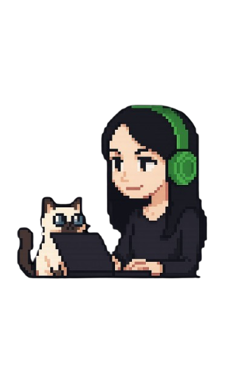

<h1 align="center">Hi there! I'm Gabriela</h1>

  

<h3 align="center">🇧🇷 Olá | 🇺🇸 Hello | 🇵🇱 Cześć</h3>

  Desenvolvedora Web Full Stack com coração em <strong>Front-End</strong> e alma criativa.  
  Geek com um olhar de designer, unindo <em>estética, performance e experiência</em>.  

---

### Sobre mim:

- **Bacharel em Desenvolvimento Full Stack**, com foco em criar produtos digitais que entregam valor real.
- Especialista em **interfaces intuitivas, acessíveis e responsivas**, com atenção aos detalhes de UI e UX.
- Background em **marketing**, o que me permite enxergar o desenvolvimento com olhar estratégico e orientado ao usuário.
- Em constante evolução: atualmente mergulhando mais fundo em **React**, **integrações com APIs** e **design system**.
- Minha gata é minha gerente de projetos (não paga, mas exige entregas em dia).

---

### Tech Stack

  
  
  
  
  
  
  
  
  
  

---

### GitHub Insights

  

---

### Vamos conversar?

  

---

> "Transformando boas ideias em experiências incríveis — uma linha de código por vez. 💚
> — **Gabriela Cancello**
 
